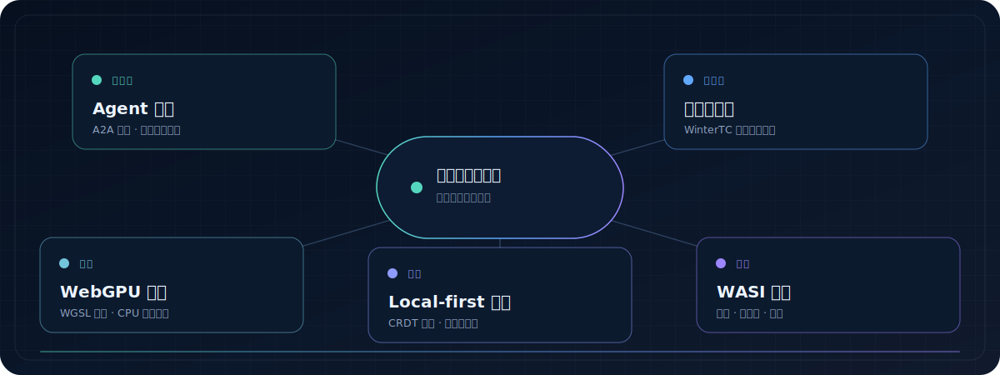

  

  <a href="#现代计算实验室">现代计算实验室</a>
  ·
  <a href="#ai-工具链">AI 工具链</a>
  ·
  <a href="#工程版图">工程版图</a>

  构建小而可审查的系统：Agent 互操作、可移植运行时、Local-first 可靠性、
  GPU 计算与 WebAssembly。
   
  Agent 系统 · 现代运行时 · 可信开发工具

  <code>TypeScript 5</code>&nbsp;
  <code>Python 3.11+</code>&nbsp;
  <code>Rust stable</code>&nbsp;
  <code>A2A 1.0</code>&nbsp;
  <code>WebGPU / WGSL</code>&nbsp;
  <code>CRDT</code>&nbsp;
  <code>WASI 0.3</code>

## 现代计算实验室

  

<table>
  <tr>
    <td width="50%" valign="top">
      <h3>
        <a href="https://github.com/abc123dx/a2a-contract-lab">
          A2A Contract Lab
        </a>
      </h3>
      

        <code>Python</code>
        <code>A2A 1.0</code>
        <code>v0.1.1 中文版</code>
      

      

        面向 Agent Card 与 A2A HTTP+JSON 行为的离线优先契约测试，内置有界
        回环模拟 Agent，并生成可移植的测试证据。
      

      

        <strong>57 项测试 · 9/9 场景通过</strong> 
        中文终端 · JSON · JUnit · 单文件 HTML
      

      

        <a href="https://github.com/abc123dx/a2a-contract-lab">查看仓库</a>
        ·
        <a href="https://github.com/abc123dx/a2a-contract-lab/releases/tag/v0.1.1">中文版发布</a>
      

    </td>
    <td width="50%" valign="top">
      <h3>
        <a href="https://github.com/abc123dx/webgpu-kernel-lab">
          WebGPU Kernel Lab
        </a>
      </h3>
      

        <code>TypeScript</code>
        <code>WGSL</code>
        <code>v0.1.1 中文版</code>
      

      

        交互式 GPU 计算工作台，包含真实向量、矩阵与图像卷积内核，并提供
        确定性 CPU 基准和本地性能指标。
      

      

        <strong>39 项测试 · 3 个 WGSL 内核</strong> 
        中位数 / p95 · 误差校验 · JSON 导出
      

      

        <a href="https://github.com/abc123dx/webgpu-kernel-lab">查看仓库</a>
        ·
        <a href="https://github.com/abc123dx/webgpu-kernel-lab/releases/tag/v0.1.1">中文版发布</a>
      

    </td>
  </tr>
  <tr>
    <td width="50%" valign="top">
      <h3>
        <a href="https://github.com/abc123dx/edge-api-atlas">
          Edge API Atlas
        </a>
      </h3>
      

        <code>Python + JS</code>
        <code>WinterTC</code>
        <code>v0.1.1 中文版</code>
      

      

        面向 Node、Deno 与 Bun 的行为级可移植性探针，覆盖 Web API、流、
        加密、压缩、计时与结构化数据。
      

      

        <strong>40 项测试 · 21 个无网络探针</strong> 
        JSON · Markdown · HTML · 跨运行时比较
      

      

        <a href="https://github.com/abc123dx/edge-api-atlas">查看仓库</a>
        ·
        <a href="https://github.com/abc123dx/edge-api-atlas/releases/tag/v0.1.1">中文版发布</a>
      

    </td>
    <td width="50%" valign="top">
      <h3>
        <a href="https://github.com/abc123dx/sync-chaos-lab">
          Sync Chaos Lab
        </a>
      </h3>
      

        <code>TypeScript</code>
        <code>Automerge 3</code>
        <code>Yjs</code>
        <code>v0.1.1 中文版</code>
      

      

        为网络分区、丢包、重复、乱序、延迟和副本重启提供确定性 CRDT
        故障注入与收敛验证。
      

      

        <strong>36 项测试 · 跨进程精确回放</strong> 
        中文 CLI · 交互式浏览器 · JSON / 单文件 HTML
      

      

        <a href="https://github.com/abc123dx/sync-chaos-lab">查看仓库</a>
        ·
        <a href="https://github.com/abc123dx/sync-chaos-lab/releases/tag/v0.1.1">中文版发布</a>
      

    </td>
  </tr>
  <tr>
    <td colspan="2" valign="top">
      <h3>
        <a href="https://github.com/abc123dx/wasi-component-lens">
          WASI Component Lens
        </a>
      </h3>
      

        <code>Rust</code>
        <code>WASI 0.3</code>
        <code>组件模型</code>
        <code>v0.1.1 中文版</code>
      

      

        面向 WebAssembly 核心模块、组件、WIT 契约与 WASI 能力的静态
        接口分析；无需执行构件即可完成盘点、快照、差异和组合检查。
      

      

        <strong>50 项测试 · Rustfmt / Clippy 全部通过</strong> 
        中文终端 · 稳定 JSON · Mermaid · macOS arm64 二进制
      

      

        <a href="https://github.com/abc123dx/wasi-component-lens">查看仓库</a>
        ·
        <a href="https://github.com/abc123dx/wasi-component-lens/releases/tag/v0.1.1">中文版发布</a>
      

    </td>
  </tr>
</table>

## AI 工具链

<table>
  <tr>
    <td width="50%" valign="top">
      <h3>
        <a href="https://github.com/abc123dx/agent-skill-aegis">
          Agent Skill Aegis
        </a>
      </h3>
      

        <code>TypeScript</code>
        <code>Node.js 20+</code>
        <code>v0.1.0</code>
      

      

        本地确定性供应链扫描器，面向 MCP 配置与 Agent Skill；无需执行发现的
        命令，即可将风险配置转成可审查的终端、JSON、HTML 或 SARIF 结果。
      

      <ul>
        <li>12 条可审查安全规则，证据自动脱敏</li>
        <li>只读发现与四种可移植报告格式</li>
        <li>用于 Pull Request 安全门禁的组合 Action</li>
      </ul>
      

        <strong>本地验证 · 2026-07-17</strong> 
        27/27 Vitest · ESLint · TypeScript 类型检查全部通过
      

      

        <a href="https://github.com/abc123dx/agent-skill-aegis">
          查看仓库
        </a>
        ·
        <a href="https://github.com/abc123dx/agent-skill-aegis/releases/tag/v0.1.0">
          v0.1.0 发布
        </a>
      

    </td>
    <td width="50%" valign="top">
      <h3>
        <a href="https://github.com/abc123dx/traceforge-otel">
          TraceForge OTel
        </a>
      </h3>
      

        <code>Python 3.11+</code>
        <code>OpenTelemetry</code>
        <code>v0.1.0</code>
      

      

        Local-first 命令行工具，将 OTLP JSON / JSONL 轨迹转成实用的 AI Agent
        诊断：关键路径、工具失败、重试、Token 用量和显式成本估算。
      

      <ul>
        <li>终端、稳定 JSON 与单文件 HTML 报告</li>
        <li>由用户提供定价规则，不内置悄然过期的价格表</li>
        <li>无需后端、账号或遥测上传</li>
      </ul>
      

        <strong>本地验证 · 2026-07-17</strong> 
        14/14 pytest · Ruff · strict mypy 全部通过
      

      

        <a href="https://github.com/abc123dx/traceforge-otel">
          查看仓库
        </a>
        ·
        <a href="https://github.com/abc123dx/traceforge-otel/releases/tag/v0.1.0">
          v0.1.0 发布
        </a>
      

    </td>
  </tr>
</table>

<table>
  <tr>
    <td width="24%" valign="middle">
      <strong>
        <a href="https://github.com/abc123dx/Model-Relay-Station">
          Model Relay Station
        </a>
      </strong>
       
      <code>Next.js 16</code> <code>TypeScript</code>
    </td>
    <td width="58%" valign="middle">
      用一个 OpenAI 兼容端点接入多个模型提供商，支持路由、故障转移、配额、
      健康检查、用量日志和本地 SQLite 存储。目前仍在早期持续开发中。
    </td>
    <td width="18%" align="right" valign="middle">
      <a href="https://github.com/abc123dx/Model-Relay-Station">
        查看项目 →
      </a>
    </td>
  </tr>
</table>

## 工程版图

  

  
    这是项目方向的概念图，不代表三个仓库组成一个捆绑平台。
  

## 当前方向

- **可互操作 Agent** — 无需依赖远程服务，即可测试 Agent Card、协议行为和信任边界。
- **可移植计算** — 比较 Web API、WebGPU 与 WebAssembly 组件边界的运行时行为。
- **可复现分布式系统** — 将 CRDT 网络分区与传输故障转成可精确回放的种子轨迹。
- **可审查 AI 基础设施** — 让路由、配置安全与运行证据保持本地、清晰、可理解。

## 构建理念

> 小接口，显式信任，可观察行为。

在合适的地方坚持 Local-first，在边界处保持类型明确，并诚实说明限制。
每个重点实验室都提供可运行代码、中文文档、测试与正式发布，无需账号或遥测。
