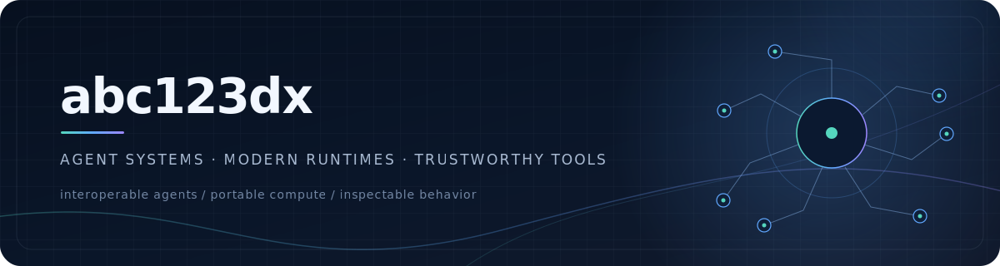
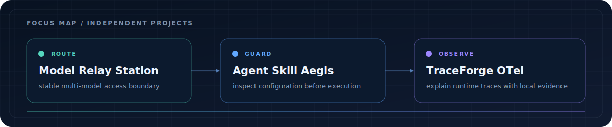

  

  <a href="#featured-work">Featured work</a>
  ·
  <a href="#focus-map">Focus map</a>
  ·
  <a href="#current-focus">Current focus</a>

  I build small, inspectable tools for AI systems: stable model interfaces,
  deterministic trust checks, and runtime evidence that can stay local.
   
  AI 基础设施 · Agent 安全 · 可观测性

  <code>TypeScript 5</code>&nbsp;
  <code>Node.js 20+</code>&nbsp;
  <code>Python 3.11+</code>&nbsp;
  <code>Next.js 16</code>&nbsp;
  <code>OpenTelemetry</code>&nbsp;
  <code>SARIF 2.1.0</code>

## Featured work

<table>
  <tr>
    <td width="50%" valign="top">
      <h3>
        <a href="https://github.com/abc123dx/agent-skill-aegis">
          Agent Skill Aegis
        </a>
      </h3>
      

        <code>TypeScript</code>
        <code>Node.js 20+</code>
        <code>v0.1.0</code>
      

      

        A local, deterministic supply-chain scanner for MCP configurations and
        Agent Skills. It turns risky configuration into reviewable terminal,
        JSON, HTML, or SARIF findings without executing discovered commands.
      

      <ul>
        <li>12 inspectable security rules with redacted evidence</li>
        <li>Read-only discovery and four portable report formats</li>
        <li>Composite action for pull-request security gates</li>
      </ul>
      

        <strong>Verified locally · 2026-07-17</strong> 
        27/27 Vitest tests · ESLint clean · TypeScript typecheck clean
      

      

        <a href="https://github.com/abc123dx/agent-skill-aegis">
          Repository
        </a>
        ·
        <a href="https://github.com/abc123dx/agent-skill-aegis/releases/tag/v0.1.0">
          v0.1.0 release
        </a>
      

    </td>
    <td width="50%" valign="top">
      <h3>
        <a href="https://github.com/abc123dx/traceforge-otel">
          TraceForge OTel
        </a>
      </h3>
      

        <code>Python 3.11+</code>
        <code>OpenTelemetry</code>
        <code>v0.1.0</code>
      

      

        A local-first CLI that turns OTLP JSON and JSONL traces into practical
        AI-agent diagnostics: critical paths, tool failures, retries, token
        usage, and explicit cost estimates.
      

      <ul>
        <li>Terminal, stable JSON, and self-contained HTML reports</li>
        <li>User-supplied pricing rules; no silently aging price table</li>
        <li>No backend, account, or telemetry upload</li>
      </ul>
      

        <strong>Verified locally · 2026-07-17</strong> 
        14/14 pytest tests · Ruff clean · strict mypy clean
      

      

        <a href="https://github.com/abc123dx/traceforge-otel">
          Repository
        </a>
        ·
        <a href="https://github.com/abc123dx/traceforge-otel/releases/tag/v0.1.0">
          v0.1.0 release
        </a>
      

    </td>
  </tr>
</table>

<table>
  <tr>
    <td width="24%" valign="middle">
      <strong>
        <a href="https://github.com/abc123dx/Model-Relay-Station">
          Model Relay Station
        </a>
      </strong>
       
      <code>Next.js 16</code> <code>TypeScript</code>
    </td>
    <td width="58%" valign="middle">
      One OpenAI-compatible endpoint for multiple model providers, with
      routing, failover, quotas, health checks, usage logs, and local SQLite
      storage. Currently in active early development.
    </td>
    <td width="18%" align="right" valign="middle">
      <a href="https://github.com/abc123dx/Model-Relay-Station">
        View project →
      </a>
    </td>
  </tr>
</table>

## Focus map

  

  
    A conceptual map of the work, not a claim that the three repositories form
    one bundled platform.
  

## Current focus

- **Stable model boundaries** — keep provider routing, health, quotas, and
  operational state behind one inspectable interface.
- **Explicit trust boundaries** — make Agent Skill and MCP risks deterministic,
  redacted, and easy to review before execution.
- **Useful runtime evidence** — turn OpenTelemetry spans into portable,
  explainable performance and reliability signals.

## Build philosophy

> Small interfaces. Explicit trust. Observable behavior.

Local-first when practical, typed at the boundaries, and honest about
limitations. A useful tool should remain understandable after the demo and
reproducible from its repository.
